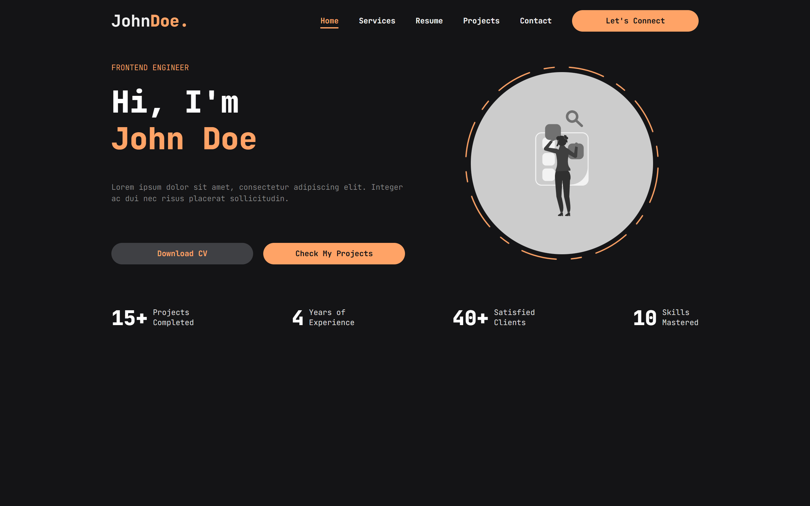
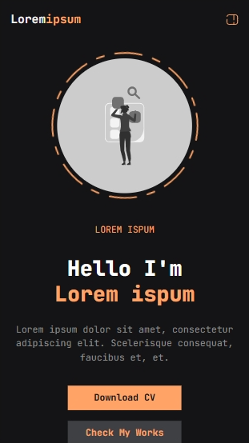

# 🚀 My Portfolio


A **personal portfolio website** to showcase your projects, skills, and experience. Built with ❤️ using **Blazor**.

---

## 🌟 Features

* 📱 **Responsive** design for desktop and mobile
* 🗂️ **Project Showcase** section
* 🙋‍♂️ **About Me** section
* ✉️ **Contact Form** for easy reach-out
* 🎨 **Easily customizable** structure and styles
* 🚀 **Automatic Deployment** with GitHub Actions & GitHub Pages
* ⚙️ **Batch File** to deploy your source branch to a target branch on GitHub with a single commit

---

## 📷 Screenshots

### 💻 Desktop View



### 📱 Mobile View



*Homepage preview using the default profile (fully customizable).*

---

## ⚡ Getting Started

### ✅ Prerequisites

📚 **New to Blazor?** Learn more here: [Introduction to Blazor](https://dotnet.microsoft.com/en-us/learn/aspnet/blazor-tutorial/intro)

* [.NET 8 SDK or later](https://dotnet.microsoft.com/download)

### ▶️ Running Locally

1. **Clone the repository:**

   ```bash
   git clone <repository-url>
   ```

2. **Navigate to the project directory:**

   ```bash
   cd my-portfolio
   ```

3. **Run the application:**

   ```bash
   dotnet run
   ```

4. **Open your browser** and go to:
   `https://localhost:5001` *(or the URL shown in the terminal)*

---

## 🛠️ Customization

### 👤 Personal Information

1️⃣ **Recommended approach:**
Create a **new file** in the `Services/Profile/` directory and define your own profile data class. Then, inject it in the `Program.cs` file like so:

```csharp
builder.Services.AddSingleton(new AppContent
{
    User = new YourCustomProfileData(),
    Layout = new PortfolioLayoutData()
});
```

2️⃣ **Alternative (Not recommended):**
You *can* use the existing `GosiJnrProfileData.cs` file **as a template** for your profile, but it's **recommended** to create your own file instead. This helps keep your custom information separate and organized.

> ⚠️ **Important:**
> Avoid editing `PortfolioLayoutData.cs` unless you fully understand how it works. Changes to this file **can lead to unexpected behaviors** in layout and functionality.

### 🎨 Styling

Customize styles in the `wwwroot/css/` folder to match your personal branding.

📌 The `app.css` file in this folder defines three main color variables: `--color-1`, `--color-2`, and `--color-3`, representing **black**, **orange**, and **white**, respectively. Each has multiple shades ranging from **darkest** to **lightest**.

Changing these variables will globally affect the color scheme of the portfolio, making it easy to personalize the look and feel of your site.

---

## 📁 Folder Structure

```
Core/       → Core logic and utilities
Models/     → Data models for the application
Pages/      → Main pages of the portfolio
Services/   → Services and profile data for the application
Shared/     → Shared layout and reusable components
wwwroot/    → Static assets (CSS, images, etc.)
```

---

## 🤝 Contributing

Contributions are welcome! 🎉
For major changes, please open an issue first to discuss what you’d like to improve.

---

## License
This project is licensed under the [CC BY-NC 4.0](https://creativecommons.org/licenses/by-nc/4.0/) license.

You're free to modify and use this project for personal or public **non-commercial** purposes, as long as you provide credit.

**Commercial use is not permitted without permission.** Contact me at: **gosijnr7@yahoo.com**

---

Built with 💻 + ☕
